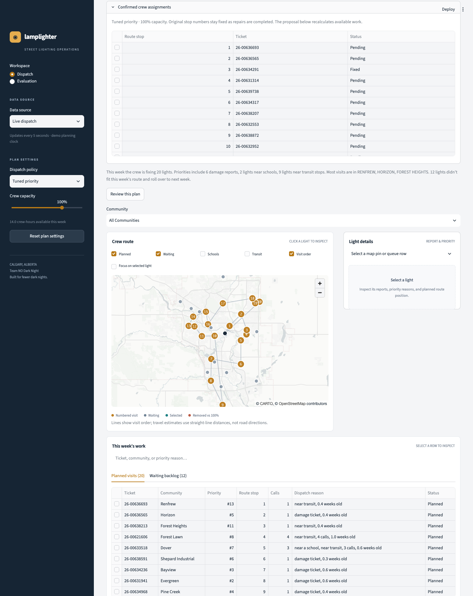
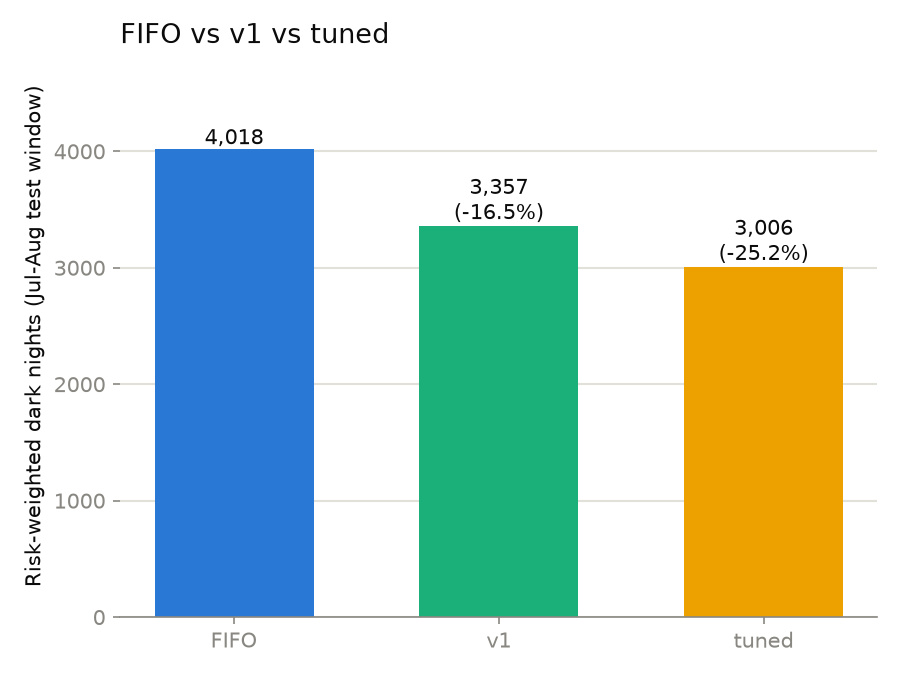
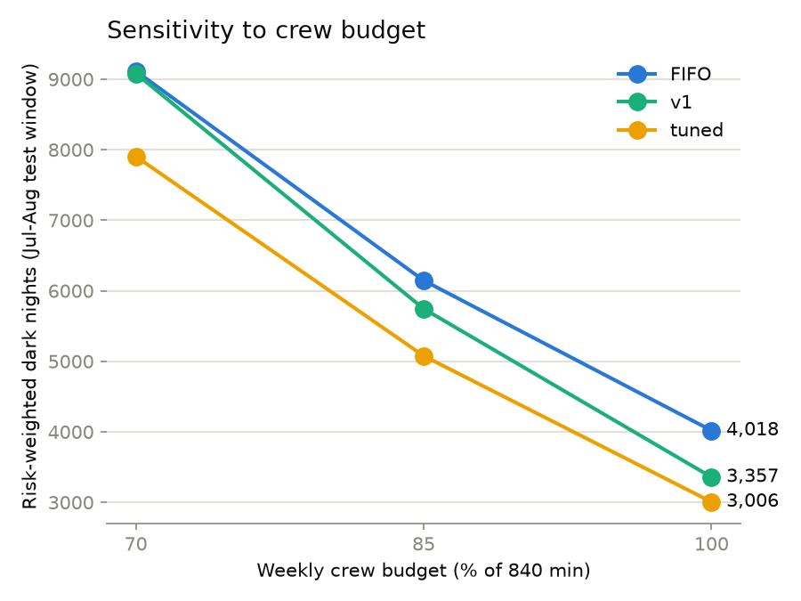

# Lamplighter: Team NO Dark Night

Lamplighter decides which reported street lights a City of Calgary crew should fix each week, so the city gets fewer dark nights per crew-hour. It replays real Calgary 311 reports, beats an oldest-first (FIFO) baseline, tunes its own priority weights, and re-plans live when a resident reports a light.

Built for the IEEE YP Industry Hackathon (Calgary, Oct 2 to 4, 2026), Case 6: Street-Light Outage Dispatch. Architecture, decisions, and team rules live in [CLAUDE.md](CLAUDE.md), the source of truth.

**Status (Oct 3):** the engine, API, dashboard, and ElevenLabs voice agent work end to end. A real browser call filed a report that appeared in Live dispatch; see [voice/sample_transcript.md](voice/sample_transcript.md). The full design is in [docs/DESIGN.md](docs/DESIGN.md).




## Project structure

```text
lamplighter/
├── config.py                 every constant and assumption (radii, budget, dates, weights)
├── Makefile                  all team commands (see Makefile guide)
├── requirements.txt          pinned dependencies
├── pyproject.toml            ruff settings
├── .env.example              environment variables to copy into .env
├── .streamlit/config.toml    dashboard theme
├── engine/                   pure decision logic, no web or database code
│   ├── data.py               load and clean 311 tickets, load school and transit layers
│   ├── geo.py                haversine distance and BallTree radius search
│   ├── features.py           near school, near transit, age, dark neighbours
│   ├── score.py              score() and reasons(), shared by replay and live API
│   ├── plan.py               plan_week(): nearest-neighbour route within the crew budget
│   ├── simulate.py           weekly historical replay, metrics, fix-date projection
│   ├── tune.py               random search over policy weights
│   ├── note.py               dispatcher note (Anthropic API, template fallback)
│   ├── live.py               the only engine module the API calls
│   └── run_all.py            regenerates everything in results/
├── api/                      FastAPI service, the only database writer
│   ├── main.py               routes and shared-key checks
│   ├── service.py            report, merge, re-rank, plan, confirm, repair logic
│   ├── db.py                 SQLite schema and queries (WAL mode, no ORM)
│   ├── schemas.py            Pydantic request and response models
│   ├── geocode.py            demo addresses, then cache, then Nominatim
│   └── seed.py               builds the demo queue as of the demo date
├── dashboard/                Streamlit app
│   ├── app.py                page layout: Dispatch and Evaluation workspaces
│   ├── data.py               API client and the saved preview loader
│   ├── maps.py               pydeck map layers
│   ├── styles.css            page styles
│   └── preview.json          saved Historical preview scenarios (built by make preview)
├── scripts/
│   ├── configure_demo.py     writes local access keys into .env
│   ├── fake_call.py          sends a sample report and status check to the API
│   ├── reset_demo.py         restores the demo state through the API
│   ├── build_dashboard_preview.py  rebuilds dashboard/preview.json
│   ├── fetch_open_data.py    downloads school and transit layers from data.calgary.ca
│   └── prepare_seed_data.py  filters the full 311 export down to the seed CSV
├── data/
│   ├── street_lights_311.csv 774 street-light tickets, Mar 23 to Aug 27, 2026
│   ├── schools.csv           506 school locations
│   ├── transit_stops.csv     6,213 active transit stops
│   ├── README.md             data sources and licence
│   └── raw/                  full 311 export goes here (gitignored, optional)
├── results/                  saved outputs of make results
├── tests/                    pytest suite for engine, API, and dashboard
├── voice/                    ElevenLabs voice agent
│   ├── system_prompt.md      agent instructions (911 first, Calgary only, read-back, hazards)
│   ├── tools.json            report_light and check_status webhook tools
│   ├── setup_agent.py        creates or updates the agent and tools (make voice)
│   ├── test_call.py          simulated test calls (make voice-test)
│   ├── SETUP.md              voice setup steps
│   └── sample_transcript.md  a real browser test call
└── docs/
    ├── DEMO_SCRIPT.md        step-by-step demo
    ├── CODE_REVIEW.md        engineering review and known modelling limits
    ├── REFACTOR_REVIEW.md    second review with prioritized findings
    ├── AGENT_PROMPTS.md      per-role prompts for the team's coding agents
    ├── DESIGN.md             design document, exported from the team's shared doc
    ├── architecture.png      system context diagram
    ├── dashboard-wireframe.png  the dashboard layout the team agreed
    └── dashboard-*.png       dashboard screenshots
```

## Requirements and setup

| Need | Version or source | Used for |
|---|---|---|
| Python | 3.11 | everything |
| [uv](https://docs.astral.sh/uv/) | any recent version (recommended) | `make setup` downloads Python 3.11 for you |
| make | any | all commands |
| ngrok | any, with an account | `make tunnel`, only for the voice agent |
| Internet | optional | map tiles, Nominatim geocoding, the LLM dispatcher note |

Install:

```bash
git clone https://github.com/satyambhanot/lamplighter.git
cd lamplighter
make setup
make configure
```

`make setup` builds `.venv` on Python 3.11 with the pinned packages. Without uv, it needs `python3.11` on your PATH, or `make setup PYTHON=/path/to/python3.11`.

**Data.** Everything the engine needs is committed in `data/`. You only need `data/raw/311_Service_Requests_-_Current_Year.csv` (the full City of Calgary 311 export, about 270 MB) if you want to rebuild the seed CSV.

**Environment variables.** Copy names from `.env.example` into `.env`. `make configure` fills in the three generated keys for you and never overwrites existing values.

| Variable | Set by | Needed for |
|---|---|---|
| `VOICE_SHARED_SECRET` | `make configure` | `POST /report` and `GET /status` (header `X-Lamplighter-Voice-Secret`) |
| `DISPATCH_SHARED_SECRET` | `make configure` | plan confirmation, repairs, report history, demo reset (header `X-Lamplighter-Dispatcher-Secret`) |
| `PHONE_HASH_SALT` | `make configure` | hashing caller phone numbers; `/report` fails without it |
| `ANTHROPIC_API_KEY` | you, optional | LLM dispatcher note; without it a template note is used |
| `LAMPLIGHTER_API_URL` | you, optional | API address for the dashboard and scripts (default `http://localhost:8000`) |
| `ELEVENLABS_API_KEY` | you | `make voice` and `make voice-test` (key with ElevenAgents access) |
| `NGROK_DOMAIN` | you | your free fixed ngrok domain, host only; used by `make tunnel` and `make voice` |
| `ELEVENLABS_AGENT_ID` and the `ELEVENLABS_*_ID` values | `make voice` | lets later runs update the same agent, tools, and secret |
| `NGROK_AUTHTOKEN` | you | listed for reference; add it with `ngrok config add-authtoken` |

## Makefile guide

| Target | What it does | Example |
|---|---|---|
| `setup` | Recreates `.venv` on Python 3.11 and installs `requirements.txt` | `make setup` |
| `configure` | Writes `VOICE_SHARED_SECRET`, `DISPATCH_SHARED_SECRET`, and `PHONE_HASH_SALT` into `.env` if missing | `make configure` |
| `test` | Runs the pytest suite | `make test` |
| `lint` | `ruff check` and `ruff format --check` | `make lint` |
| `results` | Tunes weights and regenerates every file in `results/` | `make results` |
| `preview` | Rebuilds `dashboard/preview.json` (45 saved scenarios) from the current weights | `make preview` |
| `api` | Starts the API on port 8000 with auto-reload | `make api` |
| `dash` | Starts the Streamlit dashboard | `make dash` |
| `tunnel` | Opens an ngrok tunnel to port 8000 on `NGROK_DOMAIN` (a random URL if unset) | `make tunnel` |
| `voice` | Creates or updates the ElevenLabs agent, tools, and secret; checks the tunnel first | `make voice` |
| `voice-test` | Runs one simulated caller against the agent; `SCENARIO` is `report`, `status`, `hazard`, `other_city`, or `emergency` | `make voice-test SCENARIO=hazard` |
| `reset` | Clears simulated repairs and confirmed plans and restores the demo queue | `make reset` |

- **Default target:** `make` with no target runs `setup`.
- **Overrides:** `PYTHON` picks the interpreter when uv is not installed, for example `make setup PYTHON=/usr/local/bin/python3.11`. `SCENARIO` picks the `voice-test` caller (default `report`).
- **Order:** `setup`, then `configure`, then `test`. Run `api` before `dash` (for Live dispatch), `reset`, `tunnel`, or `scripts/fake_call.py`. Run `preview` after `results`, because the saved preview uses `results/weights.json`. For voice: `api`, then `tunnel`, then `voice`.
- **Dependencies:** every target except `setup` and `tunnel` needs `.venv`. `reset` and `fake_call.py` need `configure` and a running API. `voice` needs `api` and `tunnel` running.

## How to run

**Quick start** (two terminals):

```bash
make setup && make configure
make api
```

```bash
make dash
```

Open the URL Streamlit prints (usually http://localhost:8501). The dashboard has two data sources in the sidebar:

- **Historical preview** (default) reads `dashboard/preview.json` and needs no API.
- **Live dispatch** reads the API every 5 seconds. Here you review the proposed plan, confirm it, and mark confirmed lights repaired. Confirmed stop numbers stay fixed as repairs come in. A new resident report sends a confirmed plan back for review. Writes based on an older view are rejected, and retried writes are not duplicated.

Repairs are simulated and the clock is frozen at the demo date: this is not live field status. Fix-date estimates are approximate, because they assume straight-line travel and weekly planning.

**Send a sample resident report** (API running):

```bash
.venv/bin/python -m scripts.fake_call
```

It reports a light at "City Hall", then checks the caller's status, and logs both responses. The light appears in Live dispatch within 5 seconds.

**Call the API directly** (API running):

```bash
set -a; . ./.env; set +a
curl -s -X POST localhost:8000/report -H "X-Lamplighter-Voice-Secret: $VOICE_SHARED_SECRET" -H 'content-type: application/json' -d '{"phone":"+14035550123","location_text":"King George School","description":"light is out"}'
```

The demo address list in `config.py` resolves instantly. Other addresses go to Nominatim. A description with words like "downed pole" or "exposed wires" is flagged as a hazard and kept out of the routine queue. All routes are listed at http://localhost:8000/docs and in [CLAUDE.md](CLAUDE.md).

**Other entry points:**

| Command | What it does |
|---|---|
| `make results` | Regenerates the results below |
| `make preview` | Rebuilds the Historical preview from the current weights |
| `make reset` | Restores the demo queue (API must be running) |
| `make tunnel` then `make voice` | Exposes the API on your fixed domain and points the ElevenLabs agent at it |
| `make voice-test SCENARIO=emergency` | Simulated caller; `other_city` and `emergency` print PASS when no report is filed |
| `.venv/bin/python -m scripts.fetch_open_data` | Re-downloads `data/schools.csv` and `data/transit_stops.csv` |
| `.venv/bin/python -m scripts.prepare_seed_data` | Rebuilds `data/street_lights_311.csv` from the raw export in `data/raw/` |

For a real voice call, open ElevenLabs, go to Agents, open "Lamplighter street light line", and start a test call. Full voice setup is in [voice/SETUP.md](voice/SETUP.md). The demo walkthrough is in [docs/DEMO_SCRIPT.md](docs/DEMO_SCRIPT.md).

## Results

All numbers come from `make results` (`engine/run_all.py`). Policies are tuned on March 23 to June 30 and compared only on the unseen July 1 to August 27 weeks, at the full weekly crew budget.

From `results/summary.csv`:

| Policy | Risk-weighted dark nights | vs FIFO | Total dark nights | Lights fixed | Fixes per crew-hour | Median days dark | Still dark at end |
|---|---|---|---|---|---|---|---|
| FIFO (oldest first) | 4,018.5 | | 2,262 | 167 | 1.452 | 18.0 | 29 |
| v1 (hand-set weights) | 3,357.2 | -16.5% | 2,205 | 167 | 1.470 | 18.0 | 28 |
| Tuned | 3,006.0 | -25.2% | 2,158 | 166 | 1.474 | 16.5 | 27 |



**Sensitivity** (`results/sensitivity.png`): the same three policies at 70%, 85%, and 100% of the crew budget. The tuned policy has the fewest risk-weighted dark nights at every level.



**Tuned weights** (`results/weights.json`, the best of 200 trials in `results/tuning_log.csv`):

| Weight | Tuned value |
|---|---|
| `w_age` | 0.234 |
| `w_damage` | 1.880 |
| `w_school` | 1.255 |
| `w_transit` | 0.670 |
| `w_repeat` | 0.279 |
| `w_cluster` | 1.588 |

**Crew cut** (`results/crew_cut_communities.csv`): over the full replay, cutting the tuned policy's budget to 80% costs 77 communities at least one visit, 101 lost visits in total. The five hardest hit:

| Community | Lost visits | Extra risk-weighted dark nights |
|---|---|---|
| THORNCLIFFE | 1 | 115.0 |
| RUNDLE | 1 | 76.0 |
| MOUNT PLEASANT | 1 | 74.2 |
| ABBEYDALE | 2 | 72.0 |
| WEST SPRINGS | 1 | 59.2 |

Known modelling limits are listed in [docs/CODE_REVIEW.md](docs/CODE_REVIEW.md) and [docs/REFACTOR_REVIEW.md](docs/REFACTOR_REVIEW.md).

## Configuration

All settings live in `config.py`.

| Setting | Default | Meaning |
|---|---|---|
| `DUPLICATE_RADIUS_M` | 150 | reports this close to an unfixed light merge into it |
| `SCHOOL_RADIUS_M` | 200 | "near a school" |
| `TRANSIT_RADIUS_M` | 100 | "near transit" |
| `CLUSTER_RADIUS_M` | 500 | radius for counting dark neighbours |
| `REPAIR_MINUTES` | 30 | time per repair |
| `TRAVEL_SPEED_KMH` | 30 | straight-line travel speed |
| `DEPOT_LAT`, `DEPOT_LON` | 51.04062, -114.05793 | average location of all tickets |
| `WEEKLY_CREW_MINUTES` | 840 | weekly crew budget (14 crew-hours) |
| `SENSITIVITY_BUDGET_PCTS` | 0.70, 0.85, 1.00 | sensitivity run budgets |
| `CREW_CUT_BUDGET_PCT` | 0.80 | crew-cut budget |
| `RISK_WEIGHT_*` | base 1, damage 1, school 1, transit 0.5, 0.25 per extra call (max 1) | the city's cost of one dark night; never tuned |
| `DEFAULT_POLICY_WEIGHTS` | age 1.0, damage 1.0, school 1.0, transit 0.5, repeat 0.5, cluster 0.25 | v1 policy weights |
| `TUNING_TRIALS`, `TUNING_SEED` | 200, 42 | random search size and seed |
| `TUNE_START` to `TUNE_END` | 2026-03-23 to 2026-06-30 | tuning window |
| `TEST_START` to `TEST_END` | 2026-07-01 to 2026-08-27 | test window |
| `DEMO_DATE` | 2026-08-24 | frozen "today" for the live demo |
| `DEMO_ADDRESSES` | 5 Calgary places | geocoded without a network call |
| `ANTHROPIC_MODEL` | claude-sonnet-5-5 | model for the dispatcher note |
| `DB_PATH` | api/lamplighter.db | SQLite file (gitignored) |

`WEIGHT_MAX` in `engine/tune.py` (2.0) bounds each tuned weight. Dashboard options are in `dashboard/data.py`: capacity 50% to 120% in steps of 5, and the three policies.

## Reproducibility

- **Seed:** random search uses the fixed `TUNING_SEED` and `TUNING_TRIALS` from `config.py`, so `make results` reproduces the same weights and numbers.
- **Data:** the seed CSV and both layers are committed, so a fresh clone uses identical inputs. `dashboard/preview.json` stores SHA-256 hashes of the inputs it was built from.
- **Clock:** the live demo is frozen at `DEMO_DATE`, so ranks and fix dates repeat every run.
- **Software:** Python 3.11 with the exact versions in `requirements.txt`.
- **Hardware and run time** (Apple M4 Pro, 24 GB): `make results` takes about 4 minutes, and a rerun on Oct 3 reproduced every file in `results/` byte for byte. `make test` takes 16 to 45 seconds. API startup, including seeding, takes about 3.5 seconds.

## Troubleshooting

| Problem | Fix |
|---|---|
| `Python 3.11 not found` or `is not Python 3.11` from `make setup` | Install uv, or pass `PYTHON=/path/to/python3.11` |
| `Run make configure ...` from `fake_call.py` or `make reset` | Run `make configure` |
| `/report` returns 401 | Send the `X-Lamplighter-Voice-Secret` header with the value from `.env` |
| `/report` returns `needs_clarification: true` | The address was not found; use a place in `DEMO_ADDRESSES` or a full street address |
| `make reset` or `fake_call.py` cannot connect | Start the API first with `make api` |
| Live dispatch shows "Dispatch data is unavailable" | Start the API, or switch back to Historical preview |
| Map has no street tiles | Tiles load from CARTO and need internet; the tables and controls work offline |
| Historical preview disagrees with `results/` | Run `make preview` after `make results` |
| `make voice` cannot reach `/health` | Start `make api` and `make tunnel` first; see [voice/SETUP.md](voice/SETUP.md) |
| ngrok says the domain is already in use | Another `make tunnel` is running; stop it or use that one |
| Port 8000 is in use | Stop the other process, or run `.venv/bin/uvicorn api.main:app --port 8001` and set `LAMPLIGHTER_API_URL=http://localhost:8001` |

## Team, license, and acknowledgements

- **Team:** NO Dark Night.
- **License:** MIT, Copyright (c) 2026 Satyam Bhanot. See [LICENSE](LICENSE).
- **Data:** City of Calgary 311 service requests, schools, and Calgary Transit stops from [data.calgary.ca](https://data.calgary.ca), under the Open Government Licence, City of Calgary. Details in [data/README.md](data/README.md).
- **Services:** geocoding by [Nominatim](https://nominatim.openstreetmap.org) (OpenStreetMap contributors), map tiles by CARTO, voice by ElevenLabs, dispatcher notes by the Anthropic API.
- Built for the IEEE YP Industry Hackathon, Calgary 2026.
