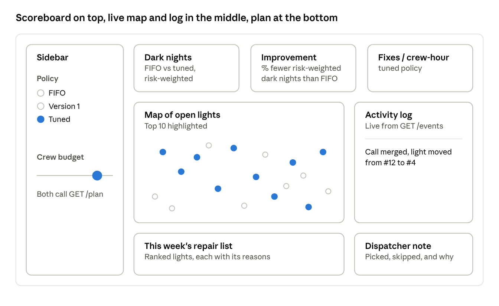

# Lamplighter Design Document

Team NO Dark Night, IEEE YP Industry Hackathon, Case 6. Exported from the team's shared design document on October 3, 2026.

## 1. Introduction

**Purpose (problem statement).** When a street light fails, Calgary residents call 311, but crews cannot visit every pole the same week. Fixing the oldest ticket first (FIFO) lets a dark stretch by a school wait behind one lamp on a quiet street. Lamplighter decides which lights the crew fixes each week and proves that choice beats oldest-first.

**Scope (and who it is for).**

- Built for City of Calgary Roads / Street Lighting dispatchers, who plan limited crew-hours. The value sold is fewer dark nights per crew-hour.
- Residents use a voice line to report a broken light or check on one, with no app or login.
- The system ranks and schedules repairs. It does not dispatch crews directly or replace the dispatcher's judgement.
- Built for the IEEE YP Industry Hackathon (October 2–4, 2026), Energy and Infrastructure stream, Case 6, by team NO Dark Night. Tagline: "Fewer dark nights per crew-hour."
- Out of scope this weekend: user login, a real phone number, cloud hosting, websockets and microservices.

**Data findings that shape the design.**

- The seed file holds 774 lighting tickets (March 23 to August 27): 771 closed and only 3 open.
- Most tickets close the same day they open, so "closed" likely means handed to maintenance, not fixed. Lamplighter therefore never uses closed\_date as a repair date.
- The organizers' starter does not filter closed tickets, so 39 of its 40 "this week" picks were already closed.
- The address column is empty, but every ticket has coordinates.

Because of these findings, Lamplighter replays March to August week by week instead of ranking today's 3 open tickets.

**References.** Case 6 README and data/README.md, JUDGING\_RUBRIC.md and DESIGN-DOC-TEMPLATE.md from the organizers' repo (nagusubra/industry-hackathon-lab); City of Calgary 311 open data; Calgary school locations (open data portal); Calgary Transit stops (open data portal).

## 2. System Overview

**System description.** Lamplighter has three user-facing parts around one decision engine:

- **Ranking engine:** replays 311 history week by week, plans each week's repairs, and counts dark nights for each policy.
- **Voice line (ElevenLabs):** residents report a light or ask for its status. Each call merges duplicates, re-ranks the queue and returns an expected fix week.
- **Dashboard:** a live map of open lights, a crew-size slider, a dark-nights scoreboard, an activity log and the dispatcher note.

**Design goals.**

- **Demo reliability:** nothing slow or random runs on stage, and the demo clock is frozen at Monday, August 24.
- **Honest results:** weights are tuned on March to June and reported only on July and August.
- **Explainability:** every rank carries its reasons, for example "damage ticket, near a school, 3 calls."
- **One source of truth:** the offline replay, the live API and the dashboard all call the same score() function, so the demo and the results slide never disagree.
- **Parallel work:** five people build against fixed contracts, one owner per file.

**Architecture summary.** A modular monolith: one Python repo, two running processes (API and dashboard), and a pure engine package at the centre. The engine knows nothing about the web or the database; the API, dashboard and scripts are thin shells around it. Five people, 36 hours and one laptop on stage do not justify microservices, queues or cloud hosting.

Offline and online work are split on purpose. Tuning runs before the demo and writes results/weights.json; the live API only reads that file.

### System context diagram


Residents reach the system only through the ElevenLabs agent, and dispatchers only through the dashboard. Both go through the API, which is the single database writer and the only live caller of the engine.

### End-to-end flow: one resident call

1. A resident calls. The ElevenLabs agent asks for the nearest address, reads it back, and asks whether the pole is down or wires are exposed.
2. The agent calls its report\_light tool, which hits POST /report on the team laptop through ngrok.
3. The API checks for hazards, geocodes the address and looks for an unfixed light within 150 m. It either merges the call (call count goes up) or creates a new light.
4. The API asks the engine to re-score the open queue with the tuned weights and project fix dates from crew capacity. It saves the new ranks and logs an event such as "Call merged, light moved from #12 to #4."
5. The agent tells the caller the light's rank and expected fix week.
6. The dashboard's Live dispatch view polls the API every 5 seconds, so the map and activity log update while the call is still going.

Two exits leave the normal path. A hazard (downed pole, exposed wires) skips the queue and goes to a human. An address that cannot be found returns needs\_clarification, and the agent asks for the nearest intersection.

## 3. Detailed Backend Design

The backend has three components: the engine makes every decision, the API service makes every write, and the voice agent handles all speech.

### Component: Engine (engine/)

**Responsibilities.** Load and clean tickets, merge duplicate reports into lights, build features, score and rank lights, plan each week's crew route, replay history, tune the policy weights, and write the dispatcher note. It is pure Python with no web or database code.

**Interfaces/functions.**

| Function | Description |
| --- | --- |
| load\_tickets() → DataFrame | Loads the 311 seed CSV, keeping date, ticket type, community and coordinates |
| build\_features(lights, layers, as\_of) → DataFrame | Adds near\_school, near\_transit, age\_days and neighbours\_dark; recomputed on every re-rank, never stored |
| score(features, weights) → Series | Weighted sum of the features; works for any number of features |
| reasons(features, weights) → list | Plain-language reasons behind each rank |
| plan\_week(queue, order, budget\_min) → list of light IDs | Walks the ranked list and adds lights while the route fits the crew budget |
| simulate(tickets, policy, budget\_min) → RunResult | Replays the weeks and returns the metrics |
| random\_search(tickets, layers, budget\_min, n\_trials, seed) → weights | Random search scored on March to June; run\_all writes results/weights.json |
| project\_fix\_dates(queue, weights, budget\_min) → dict | Expected fix week for each open light |
| live.rerank(lights, layers, weights, budget\_min, as\_of) → DataFrame | The live API's re-rank: features, score, rank, reasons and fix date for every open light |
| live.what\_if(lights, layers, policy, budget\_pct, as\_of) → dict | Read-only plan for the dashboard slider, with the dispatcher note |
| live.demo\_queue(as\_of) → DataFrame | Open lights at the demo date from the tuned replay; seeds the demo database |
| live.load\_tuned\_weights(), live.load\_live\_layers() | Read results/weights.json and the school and transit layers once at API startup |
| run\_all | Regenerates every chart and number in results/ with one command |

The live API imports only engine/live.py, so the live demo and the results slide always run the same scoring code.

**Algorithms/logic.**

*Unit of work.* A "light" is one or more reports within 150 m of each other while still unfixed. Its ID is the first ticket's ID. The 311 data already contains duplicate tickets, so merging is a real need.

*Ranking formula (the agent's strategy, tuned).* The highest score is fixed first:

```math
\text{score} = w_{age}\,\text{age_weeks} + w_{damage}\,\text{is_damage} + w_{school}\,\text{near_school} + w_{transit}\,\text{near_transit} + w_{repeat}\,(\text{call_count} - 1) + w_{cluster}\,\text{neighbours_dark}
```

| Feature | Meaning | Values | Version 1 weight | Tuned weight |
| --- | --- | --- | --- | --- |
| age\_weeks | Weeks since first report | 0, 1, 2, … | 1.0 | 0.23 |
| is\_damage | Ticket type is "Roads - Streetlight Damage" | 0 or 1 | 1.0 | 1.88 |
| near\_school | Within 200 m of a school | 0 or 1 | 1.0 | 1.26 |
| near\_transit | Within 100 m of a transit stop | 0 or 1 | 0.5 | 0.67 |
| call\_count − 1 | Extra reports merged into this light | 0, 1, 2, … | 0.5 | 0.28 |
| neighbours\_dark | Other unfixed lights within 500 m | 0, 1, 2, … | 0.25 | 1.59 |

Version 1 weights are hand-set starting points (DEFAULT\_POLICY\_WEIGHTS in config.py). A damaged pole near a school, 2 weeks old, with 1 extra call and 3 dark neighbours scores 5.25. A plain 4-week-old light scores 4.0, so the damaged pole jumps ahead of an older light where FIFO would not. Tuned weights come from results/weights.json: tuning raised damage, school, transit and dark neighbours, and lowered age and repeat calls.

*Risk formula (the city's scorecard, never tuned).* Each night a light stays dark costs:

```math
\text{risk per night} = 1 + 1\cdot\text{is_damage} + 1\cdot\text{near_school} + 0.5\cdot\text{near_transit} + 0.25\cdot\min(\text{call_count} - 1,\ 4)
```

The two formulas are separate code, and only the strategy weights are tuned. neighbours\_dark is not in the risk formula, so any gain from it comes through crew efficiency.

*Metrics.* With a fixed number of fixes per week, total dark nights come out the same in any order. So the primary metrics are ones that order and routing do change:

- Risk-weighted dark nights (primary)
- Fixes per crew-hour
- Total dark nights, median days dark, and lights still dark at the end (supporting)

*Simulation.* Planning is weekly and dark nights are counted daily. Each Monday the planner builds the week from the queue as of Sunday night. The crew works the route over five days, one fifth of the weekly budget each day. A light's fix date is the day the crew reaches it; a light reported midweek waits for the next Monday. Core assumption: a light stays dark from its first report until the crew fixes it.

*Routing.* Nearest neighbour from the depot. The planner walks the policy's ranked list and adds each light if the route still fits the budget.

*Policies compared.* FIFO (baseline), version 1 (hand-set) and tuned. Damage-first is a stretch fourth policy.

*Simulation settings (all in config.py).*

| Setting | Value | Reason |
| --- | --- | --- |
| Duplicate radius | 150 m | Callers describe locations loosely |
| School radius | 200 m | About two short blocks |
| Transit radius | 100 m | Where people wait in the dark |
| Cluster radius | 500 m | Marks a dark stretch one trip can fix |
| Repair time | 30 min per pole | Stated assumption; to validate with City crews |
| Travel speed | 30 km/h | City driving with traffic; stated assumption |
| Depot | Average location of all tickets | Real yard unknown; stated openly |
| Weekly crew minutes | 840 minutes (14 crew-hours) | Validated by real routing: about 20 fixes a week leaves a real backlog, so order matters |
| Sensitivity runs | 70%, 85%, 100% of the budget | Shows the result is not luck from one setting |
| Tuning window | March 23 to June 30 | Data the agent learns from |
| Test window | July 1 to August 27 | Never seen in tuning; only these numbers are reported |
| Demo date | Monday, August 24 | Frozen so ranks repeat every run |

*Self-tuning (the learning algorithm).* Lamplighter does not train a classifier. The data has no real repair dates, so there is no outcome to learn, and labels made from the risk formula would be circular. Instead it uses simulation-based optimization:

| ML idea | In Lamplighter |
| --- | --- |
| Model parameters | The policy weights |
| Training | Random search over weights, replaying March to June |
| Loss function | Risk-weighted dark nights |
| Validation | Replaying July and August, unseen in training |
| Prediction on new input | A new call is scored with the tuned weights and ranked |

The search tries 200 random weight sets (seed 42, each weight drawn from 0 to 2) and keeps the lowest training loss. A crew-cut run then repeats the plan at 80% of the budget and lists which communities lost a visit (77 communities at 80%, in results/crew\_cut\_communities.csv).

**Config-driven features (stretch goal).** Today the six features are defined in code by build\_features() and score(). A features.yaml list that the tuner sizes itself from would let the same engine point at another limited-crew queue. With 774 tickets, about 6 weights is what the data supports; more features need weight bounds, a penalty on large weights and a smarter search such as Optuna or CMA-ES.

*Training signal (pluggable).*

| Mode | Signal | Status |
| --- | --- | --- |
| Simulate | Cost function evaluated by replaying history | Built this weekend |
| Supervised | Real outcomes such as true repair times | Plug-in point; needs City work-order data |
| Online | Dispatcher overrides and crew fix logs, retrained weekly | Plug-in point; after deployment |

*Dispatcher note.* An LLM (Anthropic API) writes a short paragraph on what was picked, what was skipped and why. A template note fills in if the call fails or there is no internet.

### Component: API service (api/)

**Responsibilities.** Receive voice tool calls and dashboard requests, merge or create lights, call the engine to re-rank, and log events. It is the only process that writes to the database. Routes live in main.py, logic in service.py, SQL in db.py, Pydantic models in schemas.py, geocoding in geocode.py and demo seeding in seed.py.

**Interfaces/API functions.**

| Endpoint | Description | Returns |
| --- | --- | --- |
| POST /report | Takes {phone, location\_text, description}. Checks hazards, geocodes, merges within 150 m or creates a light, then re-ranks | {ticket\_id, merged, hazard, needs\_clarification, rank, old\_rank, expected\_fix\_date, message} |
| GET /status?phone= | Finds the caller's light by hashed phone number | {ticket\_id, rank, expected\_fix\_date, status} |
| GET /queue | Lists open lights in rank order | \[{ticket\_id, lat, lon, rank, score, reasons, expected\_fix\_date, comm\_name, call\_count}\] |
| GET /plan?budget\_pct=&policy= | What-if plan for the dashboard slider (policy fifo, v1 or tuned), with the dispatcher note; changes nothing | {budget\_pct, policy, lights\_planned, minutes\_used, skipped\_count, note, queue} |
| GET /events?since= | Activity log since a timestamp | \[{at, type, light\_id, message}\] |
| GET /dispatch?budget\_pct=&policy= | Everything the dashboard shows, read in one transaction; the baseline is the same queue and policy at 100% capacity | {revision, as\_of, queue, plan, baseline, events, confirmed\_plan} |
| GET /lights/{ticket\_id}/history | Reports and events for one light, never phone data; dispatcher key | {ticket\_id, history, complete} |
| POST /plans/confirm | Takes {revision, policy, budget\_pct}. Locks the reviewed plan and its stop numbers; dispatcher key | {id, policy, budget\_pct, status, created\_at, remaining\_ids, completed\_count, visits} |
| POST /fixed/{ticket\_id} | Takes {revision, plan\_id}. Marks a confirmed visit fixed; dispatcher key; rejects stale revisions | Updated light |
| POST /demo/reset | Restores the seeded demo state; dispatcher key | OK |
| GET /health | Liveness check | OK |

**Logic.**

- Hazards are checked twice: the agent's prompt asks about downed poles, and the API scans the description text. Safety never depends on one layer.
- An address that cannot be geocoded returns needs\_clarification: true instead of an error, so the agent can ask for an intersection.
- The activity log is a feature, not debugging. Showing "merged, re-ranked, #12 to #4" live is the clearest proof of autonomous reasoning (30% of the rubric).
- The reasons field lets both the dashboard and the voice agent explain every rank.
- Every re-rank goes through engine/live.py. One adapter in service.py renames the database's lat/lon to the engine's latitude/longitude; the API never copies scoring logic.
- Event types are new, merged, rerank, hazard, fixed, reset and plan\_confirmed, each with a readable message such as "Call merged, light moved from #12 to #4."
- The live clock is the demo date (Monday, August 24) for scoring, new reports and fix dates. Event timestamps use the real clock so the dashboard can poll with since=.
- Dispatcher writes use immediate SQLite transactions and carry the revision they were based on, so a stale write is rejected and a retried write is safe. A new resident report moves a confirmed plan to needs\_review until the dispatcher confirms again.
- Spoken locations are normalized before geocoding: a leading "near", "outside the" or similar is dropped, so "near King George School" matches the demo address list. Nominatim searches only inside a Calgary bounding box, so an out-of-city address returns needs\_clarification instead of a wrong light.

### Component: Voice agent (voice/)

**Responsibilities.** ElevenLabs owns all audio: speech recognition, the conversation and the spoken reply. The backend never touches audio and only receives plain HTTP tool calls. Every call must trigger a decision in the engine, so voice is never just a front end.

**Interfaces (tools).**

- report\_light → POST /report: files or merges a report and returns the rank and expected fix week.
- check\_status → GET /status: reads back the rank, expected fix week and status of the most recent report from this line.

**How the tools are wired.** Both are ElevenLabs webhook tools defined in voice/tools.json. make voice (voice/setup\_agent.py) creates or updates them and the agent, and saves their IDs to .env so re-runs update the same agent. They reach the laptop through ngrok on a fixed free domain (NGROK\_DOMAIN in .env), so the tool URLs never change. The voice key is stored as an ElevenLabs workspace secret and sent as the X-Lamplighter-Voice-Secret header; it never appears in a tool definition. The caller is never asked for a phone number: both tools send the fixed demo number +14035550100 as a constant, so check\_status returns the latest report from any demo call.

**Conversation rules.**

- **Emergencies come first.** If anyone is hurt or in danger, or the caller describes any emergency (a crash, fire, crime, medical problem or gas smell), the agent tells them to hang up and call 911 right away and files nothing. This rule overrides every other rule.
- **Calgary only.** A light in another city or town is not filed; the agent points the caller to that municipality's 311.
- Always read the location back in the caller's own words, never adding a street or quadrant, and confirm it.
- Always ask about downed poles or exposed wires before filing. Hazards are flagged for a dispatcher and never enter the routine queue; the caller is told to stay away and call 911 if anyone is in danger.
- Never state a rank, date or status the API did not return. If a tool fails, the agent says dispatch is unreachable and suggests 311.
- Replies are two sentences at most, calls stay under two minutes, and dates are said as "the week of."
- A duplicate report gets a data-driven answer, for example: "Your call was added to that report, and it moved up from #10 to #5."
- The agent is set to English. ElevenLabs supports other languages, which matters in a city as diverse as Calgary; adding them is a deployment step.

**Demo.** The pitch uses an ElevenLabs browser test call, not a phone number. A real browser call on October 3 filed a light near King George School as #10, to be fixed the week of September 1, and it appeared in the dashboard's Live dispatch view within seconds (transcript in voice/sample\_transcript.md). The API answered the tool call in 0.33 seconds. voice/ holds the prompt, tool definitions, setup and test scripts, and that transcript, so judges can see the voice part is real. A real phone number is the deployment step.

**Future work.** A crew-side voice loop: the crew lead says "what's next?" to hear the next stop and "fixed" to log the repair time. This captures the real fix dates the dataset lacks. A callback to the original reporter after a fix would confirm the light works.

## 4. Database Design

One local SQLite file (stdlib sqlite3, WAL mode, no ORM). The API is the only writer, which avoids lock errors; the dashboard reads through the API.

**Tables.**

| Table | Fields | Purpose |
| --- | --- | --- |
| lights | id (PK, first ticket's ID), lat, lon, comm\_name, is\_damage, first\_reported, call\_count, status (open, fixed or hazard), fixed\_at, score, rank, expected\_fix\_date, reasons | One row per physical light: its facts plus the engine's latest score, rank, fix date and reasons |
| calls | id (PK), light\_id (FK → lights.id), phone\_hash, channel (voice, fake or seed), location\_text, description, created\_at | Every report, including merged duplicates |
| events | id (PK), at, type, light\_id (FK → lights.id), message | The live activity log shown on the dashboard |
| geocode\_cache | query (PK), lat, lon, source | Cached address lookups so the demo never waits on a geocoder |
| dispatch\_state | id (PK, always 1), revision, seeded | One counter that rises on every write, so stale dashboard writes are rejected; seeded stops a restart from reseeding |
| plans | id (PK), policy, budget\_pct, created\_at, status (confirmed, needs\_review, superseded or completed), snapshot | Each week's plan the dispatcher confirmed |
| plan\_visits | plan\_id (FK → plans.id), light\_id (FK → lights.id), position, status | The confirmed stop number of each light and whether the crew fixed it |

**The database stores facts and decisions; the engine owns the features.** Derived features (near\_school, near\_transit, age, dark neighbours) are never stored: build\_features() recomputes them on every re-rank. A new feature built from existing facts plus a new layer needs no schema change; only a new raw input, such as pole type asked on the call, needs a column.

**Relationships.** One light has many calls; each merged report adds a call and raises call\_count. One light has many events. geocode\_cache stands alone, keyed by the address text.

**Files outside the database.** The seed CSV, the school and transit layers and their README are committed in data/. Only the full 311 export goes in data/raw/, which is gitignored. Tuned weights live in results/weights.json.

## 5. External Interfaces

**External APIs and data.** Every outside dependency has a fallback, so the live demo never depends on one service.

| Service | Used for | Fallback |
| --- | --- | --- |
| ElevenLabs Agents | Speech, conversation, and calls to our webhook tools; agent and tools created by make voice | Recorded call plus scripts/fake\_call.py |
| ngrok | Tunnel on a fixed free domain (NGROK\_DOMAIN) so ElevenLabs can reach the local API from the venue | Run fake\_call.py against localhost |
| Nominatim (OpenStreetMap) | Turning spoken addresses into coordinates inside a Calgary bounding box, cached | Demo address list first, then ask for an intersection |
| Anthropic API | Dispatcher note | Template note |
| City of Calgary open data | 311 lighting tickets, school locations and transit stops | Seed CSV, schools.csv and transit\_stops.csv committed in data/ |
| Calgary Transit stops (open data portal) | Transit stop coordinates | Committed in data/transit\_stops.csv |

scripts/fetch\_open\_data.py downloads the school and transit layers, so anyone can rebuild them. The full 311 dump is never committed.

**Network protocols/communication.** REST over HTTP with JSON (FastAPI). ElevenLabs calls the API as webhook tools over HTTPS through ngrok. The dashboard polls REST endpoints every 5 seconds; there are no websockets.

## 6. Security Considerations

**Authentication.** There is no user login this weekend; the dashboard runs on the team laptop. Two shared keys protect the API: voice tool calls send X-Lamplighter-Voice-Secret, and dispatcher writes, report history and demo reset send X-Lamplighter-Dispatcher-Secret. The API rejects calls without the right key. make configure generates both keys and the phone-hash salt into the ignored .env without overwriting existing values. In production, dispatchers sign in through the City's single sign-on.

**Authorization.** Only the API writes to the database; the dashboard and scripts go through it. In production, dispatcher roles would come from single sign-on.

**Data protection.**

- Phone numbers are stored only as salted hashes, with the salt in .env. Status lookups compare hashes, so they work the same.
- Phone numbers are used only for status lookup and never shown on the dashboard.
- API keys live only in .env, which is gitignored; only .env.example is committed. The repo is public, so run git status before every commit.
- If a key is ever pushed, revoke it in the provider's dashboard at once; deleting the commit is not enough on a public repo.
- The voice key reaches ElevenLabs only as a workspace secret, referenced by ID in the tool headers. Editor backup folders (.history/) are gitignored because they can hold copies of .env.

**Caller safety.** The agent never files a hazard as a routine ticket. Downed poles and exposed wires go to a human or emergency line, and the API double-checks the description text.

## 7. Frontend/UX Design

**UX design.** One Streamlit app (dashboard/app.py) with a pydeck map of Calgary. In Live dispatch it refreshes every 5 seconds with st.fragment(run\_every=5). It replaces a hardware "wow moment" with a live one: judges watch a call land on the map and the list re-rank.

**Frontend design (as built on main).**

- **Sidebar:** workspace (Dispatch or Evaluation), data source (Historical preview, the default, or Live dispatch), dispatch policy (FIFO, version 1, tuned) and crew capacity (50–120%).
- **Top row:** planned visits, crew-hours allocated and the waiting backlog for the chosen policy and capacity.
- **Plan review:** the dispatcher note, then Review and Confirm (Live dispatch only). Confirmed stop numbers stay fixed as repairs are recorded.
- **Middle:** a community filter, the map with numbered stops and school, transit and visit-order layers on the left, and the selected light's details and report history on the right.
- **Bottom:** planned and waiting tables with CSV export, capacity impact against a 100% plan, and recent activity (Live dispatch).
- **Evaluation workspace:** the FIFO, version 1 and tuned results table.

**Gaps against the agreed layout (open decision).** The wireframe below is the layout the team agreed. As built, the FIFO-vs-tuned headline cards sit in the Evaluation workspace, the activity log is a collapsed Recent activity panel showing four events, and the dashboard opens on Historical preview, so a live call only appears after switching to Live dispatch. Decide before the demo whether to bring the headline cards and the activity log back to the main view.



The sidebar controls re-plan the week through GET /dispatch without changing stored data, so judges can try any crew size safely.

**Demo moment.** A teammate calls in a broken light, it appears on the map and jumps the queue, then the presenter drags the crew slider down to 80% and shows which communities lose a visit.

## 8. Tech Stack Choices

Every choice was made against one question: does it make the demo more reliable or the result more convincing?

| Area | Choice | Why |
| --- | --- | --- |
| Language | Python 3.11 in a venv built by uv (or python3.11); every package pinned in requirements.txt | Everyone knows it; pinned versions keep every laptop identical (an unpinned pandas broke live reports on October 3) |
| Backend | FastAPI with Pydantic schemas | Typed contracts and free docs at /docs |
| Engine | pandas, numpy, scikit-learn BallTree (haversine) | Fast radius searches for duplicates, schools and transit |
| Database | SQLite via stdlib sqlite3, WAL mode, no ORM | Zero setup; the API is the only writer |
| Frontend | Streamlit with pydeck | Fastest path to a live map with no extra packages |
| Charts | matplotlib PNGs in results/ | Reproducible and easy to drop into slides |
| Tuning | Random search, 200 trials, seed 42 | Simple, explainable, deterministic; Optuna is a stretch goal |
| Voice | ElevenLabs agent with two webhook tools | ElevenLabs owns speech; also targets the ElevenLabs prize |
| Tunnel | ngrok | One command; works on venue Wi-Fi |
| Geocoding | Demo address list, then Nominatim, cached | The demo never depends on an outside service |
| Dispatcher note | Anthropic API with a template fallback | Works with no key or no internet |
| Quality | ruff (lint and format), pytest | One fast tool and a few targeted tests |
| Tasks | Makefile | Everyone runs the same commands |

**Team commands.**

```
make setup       # build .venv on Python 3.11 with pinned requirements
make configure   # generate local access keys in the ignored .env
make results     # python -m engine.run_all
make preview     # rebuild the dashboard's saved historical scenarios
make api         # uvicorn api.main:app --port 8000
make dash        # streamlit run dashboard/app.py
make tunnel      # ngrok http 8000 on the fixed NGROK_DOMAIN
make voice       # create or update the ElevenLabs agent and tools
make voice-test  # simulated call: SCENARIO=report|status|hazard|other_city|emergency
make test        # pytest -q
make reset       # restore demo state (needs the dispatcher key)
```

**Repo layout.**

```
lamplighter/
├── config.py         all constants and assumptions
├── Makefile
├── engine/           data, geo, features, score, plan, simulate, tune, note, run_all
│   └── live.py       the only engine module the API calls
├── api/              main, service, db, schemas, geocode, seed
├── dashboard/app.py
├── voice/            prompt, tool definitions, setup and test scripts, sample transcript
├── scripts/          fetch_open_data.py, fake_call.py
├── data/             seed CSV; raw/ is gitignored
├── results/          charts, tables, weights.json
├── tests/
└── docs/             DESIGN.md, DEMO_SCRIPT.md, AGENT_PROMPTS.md
```

## 9. Testing Strategy

**Unit testing (pytest).** 90 tests across the engine, API, geocoding, dashboard and voice setup; make test runs them in about 16 seconds. They include:

- The score formula returns the expected values, such as 5.25 for the damaged pole and 4.0 for the plain light in Section 3.
- Two calls 100 m apart merge into one light.
- The simulation counts dark nights correctly on a tiny hand-made case.
- A new resident report re-ranks correctly next to seeded lights, and hazards never enter the queue.

**Result evaluation.**

- Only July and August (held out from tuning) are reported.
- Three policies are compared: FIFO, version 1 and tuned, with damage-first as a stretch fourth. Beating a sensible simple rule is more convincing than beating the weakest baseline.
- Every policy runs at 70%, 85% and 100% of the crew budget, plus the 80% crew-cut run.
- make results regenerates every number and chart, so any figure can be reproduced live in Q&A.
- If the tuned weights do not beat version 1 on the test window, the team reports it honestly; the gain over FIFO is still the story.

**Current results.** On the unseen July–August weeks, the tuned policy cuts risk-weighted dark nights by 25.2% against FIFO and 10.5% against version 1 (results/summary.csv, regenerated on October 3). Both earlier caveats are resolved: the school and transit layers are committed in data/, so a fresh clone reproduces these numbers, and the risk score now counts school and transit weights (tested in tests/test\_simulate.py). The engineering reviews in docs/CODE\_REVIEW.md and docs/REFACTOR\_REVIEW.md list the remaining modelling limits.

| Policy | Risk-weighted dark nights | vs FIFO | Median days dark | Fixes per crew-hour | Still dark at end |
| --- | --- | --- | --- | --- | --- |
| FIFO | 4,018.5 | — | 18 | 1.452 | 29 |
| Version 1 | 3,357.2 | −16.5% | 18 | 1.470 | 28 |
| Tuned | 3,006.0 | −25.2% | 16.5 | 1.474 | 27 |

**End-to-end testing.**

- scripts/fake\_call.py hits POST /report, and the light appears on the map with a re-rank in the activity log.
- An ElevenLabs browser test call reaches the API through ngrok and hears back a rank and fix week. Passed on October 3 (voice/sample\_transcript.md).
- make voice-test plays five simulated callers against the real agent: report, status, hazard, other city and emergency. ElevenLabs simulations mock tool results, so these check how the agent talks and reads results; the other-city and emergency calls must end with no report filed. All five pass. The tests found and fixed two problems: the agent invented a street when reading a location back, and "near King George School" failed to geocode.
- make reset restores the demo state before every rehearsal.
- A fresh clone runs with make setup; a piece is only "done" when it does.

## 10. Delivery Plan and Risks

**Roles.** Five people, one owner per file; each works on a branch named after themselves. The prompt each person gives their coding agent is in docs/AGENT\_PROMPTS.md.

| Role | Owns | Files |
| --- | --- | --- |
| Engine lead | Live engine entry point, fix dates, demo snapshot, results, data layers | engine/, results/, data/ |
| Backend lead | API, database, re-rank on every call, demo seed | api/ (except geocode.py) |
| Voice lead | ElevenLabs agent, geocoding, demo addresses, fake call script | voice/, api/geocode.py, scripts/fake\_call.py |
| Dashboard lead | Map, slider, scoreboard, activity log, dispatcher note panel | dashboard/ |
| Pitch lead | Slides, architecture diagram, demo script, design doc, README, demo video | docs/, README.md |

**Working rules.** main must always run. Merge at least every three hours with small pull requests and one teammate's review. Run git pull origin main before each work session.

**Checkpoints.**

- [x] Sat 10:00: contracts merged; API and dashboard run on fake data
- [x] Sat 13:00: thin slice works end to end with FIFO; a fake call appears on the map; the voice agent reaches the API
- [x] Sat 18:00: scoring, tuning, crew cut, dispatcher note and activity log all working
- [ ] Sat 21:00: feature freeze; record the backup demo video
- [ ] Sun 10:30: submitted (hard deadline is noon)

**Status, Saturday 20:45.** Engine, API, dashboard and the ElevenLabs voice agent are merged to main, and all 90 tests pass. A real browser call filed a report end to end, so the 13:00 thin slice is now complete. The dashboard's Historical preview was rebuilt from the current tuned weights, and all 45 saved scenarios match the live engine. Left before the 21:00 freeze: rehearse the demo and record the backup video.

**Risk register.**

| Risk | Fallback |
| --- | --- |
| Venue Wi-Fi or ngrok fails | Run fake\_call.py live and show the recorded call |
| An address cannot be geocoded | Demo address list, then ask for an intersection |
| Tuned weights do not beat version 1 on the test window | Report it honestly; the gain over FIFO is still the story |
| A judge asks how long lights really stay dark | State the assumption: a light stays dark from its first report until the crew fixes it, and "closed" is never read as fixed |
| A judge calls the result circular | Show the strategy and scorecard are separate, and the result holds on unseen weeks at three crew sizes |
| Merge conflicts | Folder ownership and small, frequent merges |
| LLM call fails | Template note fills in automatically |
| Voice not working by Saturday evening | Demo it from the backup recording; keep the live demo on the dashboard |

**Assumptions to validate with the City.**

- What does "closed" mean for these tickets: handed to maintenance, or actually fixed?
- Are 30 minutes per repair and 30 km/h realistic?

**Production story (scalability slide).** A nightly job pulls new tickets from the 311 open data feed. The offline layer runs on Databricks over the full multi-year 311 history, and weights are re-tuned weekly. The API runs in the City's cloud behind a real phone number, with single sign-on for dispatchers. The same engine extends to other limited-crew queues such as potholes and traffic signals.
